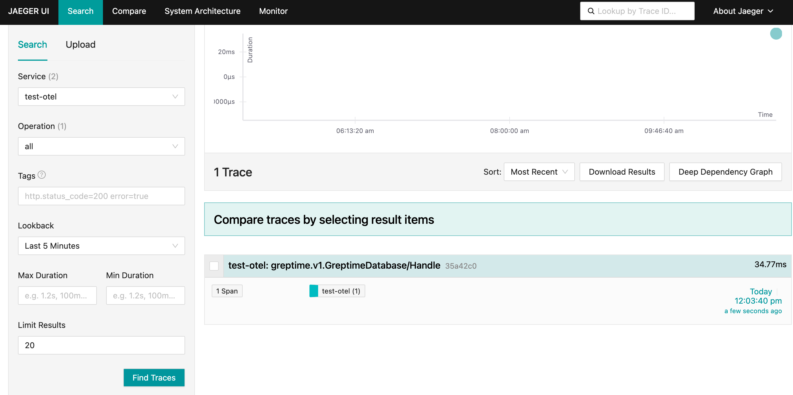

# Enable Opentelemetry

## Install Jaeger
Use [Jaeger](https://github.com/jaegertracing/helm-charts/tree/main/charts/jaeger) as the backend storage for tracing, save the following configuration to **jaeger-values.yaml** file:
```yaml
provisionDataStore:
  cassandra: false

storage:
  type: memory

agent:
  enabled: false

collector:
  enabled: false

query:
  enabled: false

allInOne:
  enabled: true

  extraEnv:
    - name: COLLECTOR_OTLP_ENABLED
      value: "true"
```

Use [helm](https://helm.sh/) command to install:
```
helm repo add jaegertracing https://jaegertracing.github.io/helm-charts
```
```
helm install jaeger jaegertracing/jaeger --values jaeger-values.yaml -n default
```

Expose the jaeger port to the localhost:
```
kubectl port-forward svc/jaeger-collector -n default 4317:4317 > jaeger.out &
```
```
kubectl port-forward svc/jaeger-query -n default 16686:16686 > jaeger.out &
```

## Running the Example
```go
go run main.go
```

Output:

```log
2024/09/19 11:36:29 Waiting for connection...
2024/09/19 11:36:29 serving metrics at localhost:2233/metrics
2024/09/19 11:36:29 affected rows: 1
2024/09/19 11:36:29 Sleep 30s...
2024/09/19 11:36:39 Done!
```

## View metrics
We can use `curl localhost:2233/metrics` to view the metrics data. Also, configure [Prometheus](https://prometheus.io/) to scrape it as follows:
```
global:
  scrape_interval: 10s 

scrape_configs:
  - job_name: greptimedb-ingester-go
    static_configs:
    - targets: ['localhost:2233']
```

## View tracing
Open the address http://localhost:16686/ to view tracing data.


