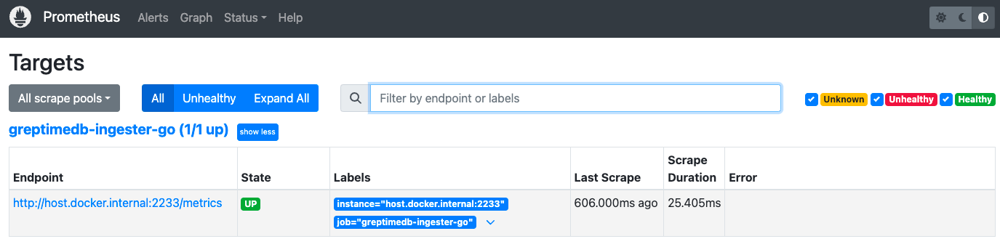

# Enable Opentelemetry

## Install Jaeger
Use [Jaeger](https://github.com/jaegertracing/jaeger) as the backend storage for tracing:
```
docker run --rm --name jaeger \
  -e COLLECTOR_ZIPKIN_HOST_PORT=:9411 \
  -p 6831:6831/udp \
  -p 6832:6832/udp \
  -p 5778:5778 \
  -p 16686:16686 \
  -p 4317:4317 \
  -p 4318:4318 \
  -p 14250:14250 \
  -p 14268:14268 \
  -p 14269:14269 \
  -p 9411:9411 \
  jaegertracing/all-in-one
```

## Install Prometheus
Write the [Prometheus](https://prometheus.io/) configuration file and save it as **prometheus.yml**:
```
global:
  scrape_interval: 10s 

scrape_configs:
  - job_name: greptimedb-ingester-go
    static_configs:
    - targets: ['host.docker.internal:2233']
```

Run prometheus:
```
docker run \
  -p 9090:9090 \
  -v $(pwd)/prometheus.yml:/etc/prometheus/prometheus.yml \
  prom/prometheus
```


## Example
Enable opentelemetry in the configuration：
```go
cfg := greptime.NewConfig(host).WithDatabase(database).
  WithTraceProvider(tracerProvider).WithTracesEnabled(true).
  WithMeterProvider(meterProvider).WithMetricsEnabled(true)
```

Running the example:
```go
go run main.go
```

Output:

```log
2024/09/19 11:36:29 Waiting for connection...
2024/09/19 11:36:29 serving metrics at localhost:2233/metrics
2024/09/19 11:36:29 affected rows: 1
2024/09/19 11:36:29 Sleep 30s...
2024/09/19 11:36:39 Done!
```

## View metrics
We can use `curl localhost:2233/metrics` to view the metrics data. Also, Open the address http://localhost:9090/ to view metrics data.



## View tracing
Open the address http://localhost:16686/ to view tracing data.


